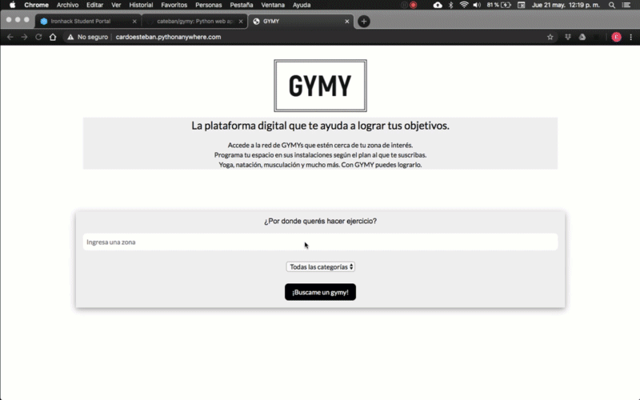

# 

The next project is the development of an MVP for a business dedicated to locating places of physical activity in Guatemala City, Guatemala. The general idea is based on making strategic alliances with different establishments that allow the influx of people subscribed to GYMY.

The main code requires user input and the category in which you want to search to display a map with the information of the affiliated establishments.

### For this project I'm using the following libraries:

- Regex
- Requests
- BeautifulSoup
- Unidecode
- Numpy
- Selenium 
- Pandas
- TQDM
- Time
- Slugify
- Opencage
- Folium
- Flask
- Geopy
- Os

### In order to achieve the main result, I'm folowing 4 steps:

#### Step 1 - Getting the data

Probably the most difficult and time consuming step. With the help of the libraries mentioned above, it was possible to scrape over 300 physical activity establishments in Guatemala.

#### Step 2 - Clean the data

After obtaining the data in the previous step, it had to be cleaned due to the format inconsistency (especially in the addresses) to be able to feed the main code and obtain the correct latitudes and longitudes to geolocate each point.

#### Step 3 - Main code and HTML

The main code is based on converting the address requested by the user into its corresponding latitude and longitude. Then, the distance between user input and all establishments in the database is calculated.

A new DataFrame is generated with the results that are less than 2 kilometers from the requested point.

The map is created with the information of the new DataFrame, it is saved and edited adding ' ' at the end of the HTML generated by Folium so that it can be correctly displayed in the main HTML of the web app .

If all the information is correct, the result is displayed on the main page. Otherwise, different responses are returned, depending on the case, without showing any map and returning what is happening to the user.

#### Step 4 - Pythonanywhere

After testing with Flask in local and verifying that everything was working properly, it is mounted in Pythonanywhere for anyone to access.

#### Project Preview

You can check it out at http://cardoesteban.pythonanywhere.com/

#### Next Steps

Currently it has some limitations such as the number of requests that can be made per day with Geocage and the complexity of the addresses in Guatemala City to be able to correctly parse them to their respective latitudes and longitudes. The general idea of the project would be to start in Guatemala City and gradually scale it up to all the countries of Central America.
